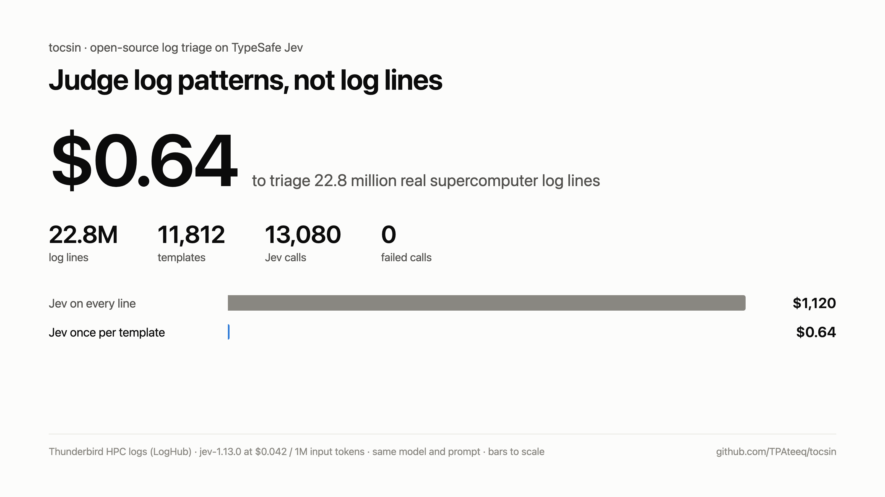
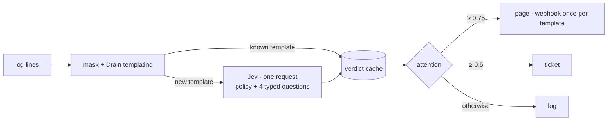

# tocsin

A tocsin is the bell you ring when something is actually wrong. This one collapses a log
stream into patterns, asks TypeSafe's [Jev](https://typesafe.ai) about each pattern once,
and routes every line to `page`, `ticket`, or `log` using a paging policy you write in
plain English.

Sentry had the right idea: group by pattern, alert on the group. tocsin does that for raw
logs, and asks a model whether the group is worth waking someone.

```
22,833,750 log lines → 11,812 templates → 13,080 Jev calls → $0.64
the same model and prompt on every line would cost $1,120
```



The full write-up, including the run where it lost, is at
<https://tpateeq.github.io/tocsin/>, built from [docs/index.html](docs/index.html).

## How it works



Numbers, IPs, UUIDs, hex values and emails get masked. HTTP status codes keep their class,
so `GET /checkout 500` becomes `GET /checkout <5xx>` and never merges with a 200. Lines are
then grouped with Drain, using the streaming `drain3_rust` engine from
[codag-drain](https://github.com/codag-megalith/codag-drain). A pattern that repeats a
million times is judged once.

Each new pattern goes to Jev in one request carrying your policy and four questions:

| question | type | what it asks |
|---|---|---|
| `pageable` | noul | does the policy say to page for this event? |
| `detail` | noul | is this a stack frame, register dump or other continuation line? |
| `severity` | score 0-3 | how bad is it |
| `area` | choice | which part of the system |

Code owns the decision: `attention = pageable × (1 − detail)`. Pages reach a webhook at
most once per pattern per cooldown, carrying the number of occurrences since the last one.

Jev sees one masked template per pattern plus your policy, never the raw log stream.

## Install

```sh
cargo install --git https://github.com/TPAteeq/tocsin
export TYPESAFE_API_KEY=...
```

or `docker run -p 4318:4318 -e TYPESAFE_API_KEY ghcr.io/tpateeq/tocsin` once a tagged
release has published the image.

## Triage a file or a pipe

```sh
kubectl logs deploy/api --since=1h | tocsin triage
```

Each line comes back as JSON. Output from a real run with the default policy:

```
route   attention  pageable  detail  line
page    0.89       0.97      0.08    kernel: Out of memory: Killed process 4121 (postgres) total-vm:8123456kB
page    0.85       0.90      0.06    EXT3-fs error (device sda5): ext3_journal_start_sb: Detected aborted journal
ticket  0.51       0.54      0.05    checkout error payment provider timeout after 30000ms, order 81723 not charged
log     0.18       0.19      0.05    user 1234 failed login: invalid password
log     0.01       0.12      0.95    at com.shop.checkout.CartService.total(CartService.java:88)
log     0.04       0.04      0.03    GET /healthz 200 2ms
```

`--only page,ticket,log` picks which routes are printed (default `page,ticket`).

## Run it as a service

```sh
tocsin serve --listen 0.0.0.0:4318 --webhook https://hooks.slack.com/services/...
```

| endpoint | accepts |
|---|---|
| `POST /v1/logs` | OTLP/HTTP logs with JSON encoding (not protobuf), gzip or plain |
| `POST /ingest` | plain text lines or NDJSON (`message`, `msg`, `log`, `body` or `text`) |
| `GET /templates` | every template seen, with its verdict, route and count |
| `GET /healthz` | liveness |

Point an OpenTelemetry Collector ([example](examples/otel-collector.yaml)) or Vector
([example](examples/vector.toml)) at it. The webhook payload has a Slack-compatible
`text` field plus `template`, `example`, `count`, `pageable`, `detail`, `severity` and `area`.

The ingest queue is capped at 256 MiB; past that the server answers `429` so collectors
back off and retry. Webhook deliveries retry on `429`, `5xx` and network errors, pending
alerts are flushed every few seconds even when traffic stops, and anything still pending
is sent on shutdown. If the TypeSafe API is unreachable, templates fall back to local
keyword rules for that batch and are judged again when they next appear.

## Point an agent at it

Everything tocsin emits is JSON with a stable shape, so an agent can sit on the other end
of it. Send the webhook to an agent runner and each payload names one pattern, the verdict
behind it, an example line, and how many times it fired since the last alert. Or poll
`GET /templates` for the current board, sorted by attention. Or pipe `tocsin triage`
straight into the agent.

An agent that gets one alert per pattern has a much easier job than one reading a log
stream: the deduplication already happened, an example line is attached, and the count
tells it whether the problem is spreading.

## Write your own policy

The built-in policy ([policies/default.json](policies/default.json)) is written for
infrastructure logs. Services need their own:

```sh
tocsin serve --policy examples/policies/web-service.md
```

A policy is plain English or JSON. It is part of the cache key, so editing it re-judges
templates on their next occurrence. On the sample above, the
[web-service policy](examples/policies/web-service.md) drops the EXT3 journal error from
0.85 to 0.26 because that policy says nothing about disks, and the single failed payment
from 0.51 to 0.30 because it only pages when many users are affected.

## Measure it on your own logs

```sh
tocsin eval labeled.tsv --out report.json
```

`labeled.tsv` has one `<0|1><TAB><log line>` per line. The report covers precision,
recall, F1, PR-AUC, ROC-AUC, calibration, a per-template breakdown and cost, next to a
keyword-rules baseline and a rare-template baseline. Label a week of incidents, try a
policy, compare.

`--offline` swaps Jev for local keyword rules everywhere, with no API calls.

## Benchmarks

Public LogHub datasets with line-level alert labels from the sites' administrators.
Laptop run (Apple Silicon), TypeSafe API called from India, `jev-1.13.0`, 24 concurrent
requests, priced at TypeSafe's published $0.042 per million input tokens.

### Cost and speed

| dataset | lines | templates | Jev calls | input tokens | cost | every line | wall |
|---|---:|---:|---:|---:|---:|---:|---:|
| BGL | 4,747,963 | 1,126 | 1,496 | 1.74M | $0.073 | $232 | 55s |
| Thunderbird sample | 22,833,750 | 11,812 | 13,080 | 15.3M | $0.64 | $1,120 | 6m 23s |

Templating runs at roughly 390k lines/s on one core. Jev latency was about 370 ms p50
and 450 ms p95, with zero failed calls. Two independent cold runs routed 99.87% of BGL
lines and 99.29% of Thunderbird lines identically.

### Accuracy

How these were produced matters, so read the notes under the table.

| dataset | role | scorer | precision | recall | F1 | PR-AUC | ROC-AUC |
|---|---|---|---:|---:|---:|---:|---:|
| BGL | development | tocsin (page ≥ 0.75) | 0.913 | 0.813 | 0.860 | 0.941 | 0.995 |
| BGL | development | keyword rules | 0.254 | 1.000 | 0.406 | 0.348 | 0.926 |
| Thunderbird | held out | tocsin (page ≥ 0.75) | 0.000 | 0.000 | 0.000 | 0.122 | 0.867 |
| Thunderbird | held out | keyword rules | 0.123 | 0.999 | 0.220 | 0.373 | 0.984 |

BGL was used to design the system. The Drain similarity of 0.7 was picked on its first
million lines, and the `detail` question, the default policy and the thresholds all came
out of error analysis on it. Those numbers show what a tuned policy can do. They say
nothing about how a generic one travels. An earlier version scored F1 0.296 (PR-AUC 0.420)
on BGL's held-out later 3.75M lines, before that analysis.

Thunderbird stayed untouched until one final run over a sample fixed in advance: every
tenth of its 74 shards. The default policy did not transfer. 99.7% of its alert lines come
from a single pattern, `kernel: <*> <*> failed, return code = -<NUM> (Fatal error (Local
Catastrophic Error))`, which scored 0.65 and went to `ticket`. What it did page were
out-of-memory kills, disk I/O errors, a file descriptor limit and lost network routes.
Thunderbird's administrators labeled none of those as alerts.

Which is the whole point. Every site draws the wake-someone-up line somewhere else, and a
public label set is just one site's answer. Here that answer is an input. Write your
policy, label a sample of your own logs, and run `tocsin eval` before you trust it.

Reproduce:

```sh
scripts/fetch-loghub.sh && scripts/fetch-thunderbird-sample.sh
tocsin eval data/bgl.tsv --out results/bgl.json
tocsin eval data/tbird-sample.tsv --out results/thunderbird.json
```

## Configuration

| flag | env | default |
|---|---|---|
| (env only) | `TYPESAFE_API_KEY` | required unless `--offline` |
| `--model` | `TOCSIN_MODEL` | `jev-latest` |
| `--policy` | `TOCSIN_POLICY` | built-in infrastructure policy |
| `--page-threshold` / `--ticket-threshold` | | `0.75` / `0.5` |
| `--concurrency` | | `32` |
| `--cache` / `--no-cache` | | `.tocsin/verdicts.json` |
| `--similarity` / `--depth` | | `0.7` / `4` |
| `--webhook` (serve) | `TOCSIN_WEBHOOK` | alerts printed to stderr |
| `--only` | | `page,ticket` |
| `--cooldown-secs` (serve) | | `600` |

## Limits worth knowing

- Lines longer than 16 KiB are truncated before templating.
- One process per cache file. Two writers on the same file overwrite each other's new entries.
- `jev-latest` is an alias. Cached verdicts are replaced when a new template reveals a newer
  model, so pin a version such as `--model jev-1.13.0` if you want verdicts to stay fixed.
- Webhook alerts are retried four times with backoff, then logged and dropped.

## Credits

Templating uses `drain3_rust` from [codag-drain](https://github.com/codag-megalith/codag-drain)
(MIT), itself a port of IBM's [Drain3](https://github.com/logpai/Drain3). Judgments come
from TypeSafe's Jev. Benchmarks use [LogHub](https://github.com/logpai/loghub)
(Zhu et al., ISSRE 2023) and the logs from Oliner and Stearley, *What Supercomputers Say*
(DSN 2007).

## License

MIT
